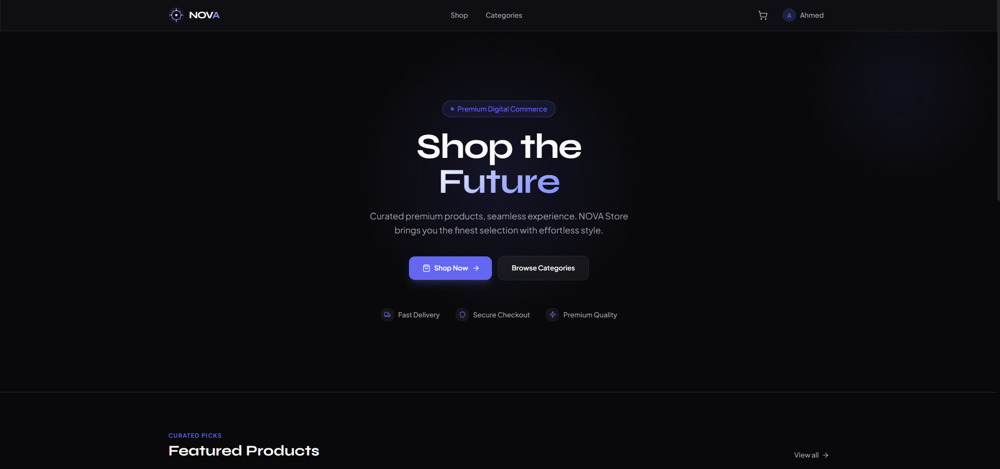
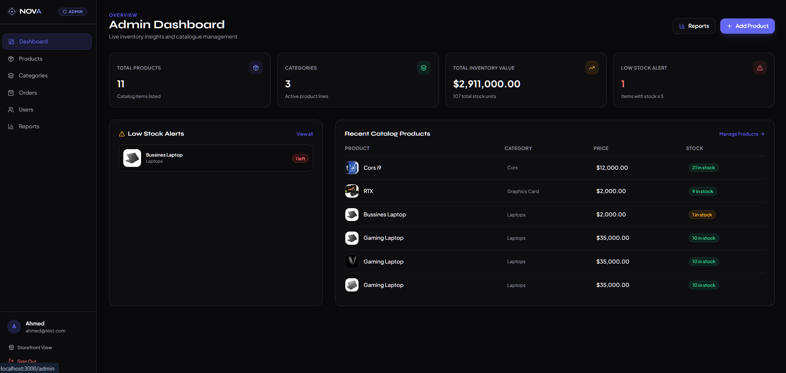
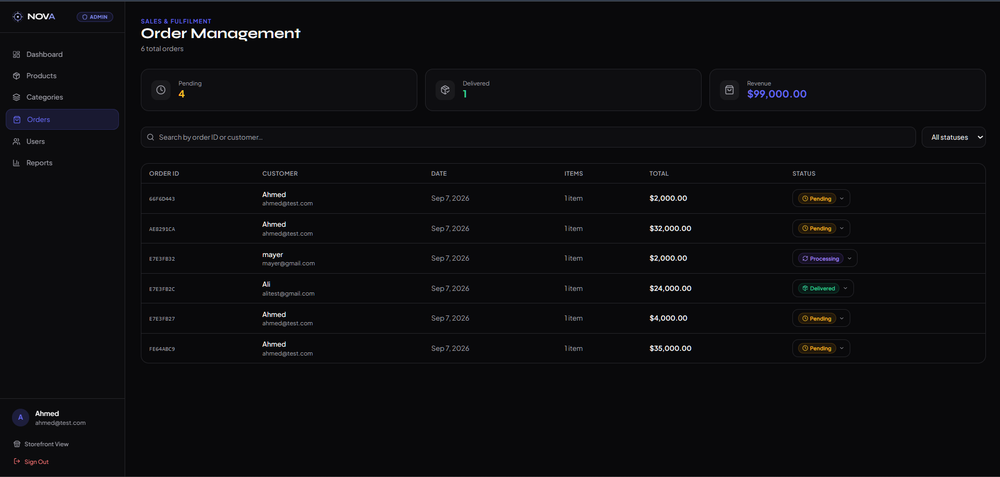
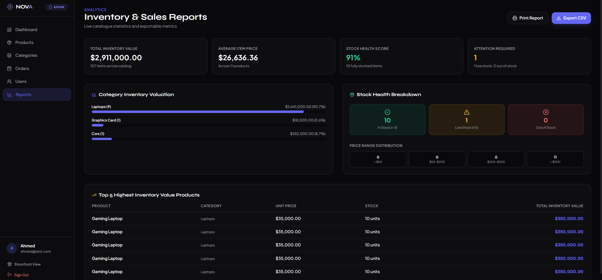
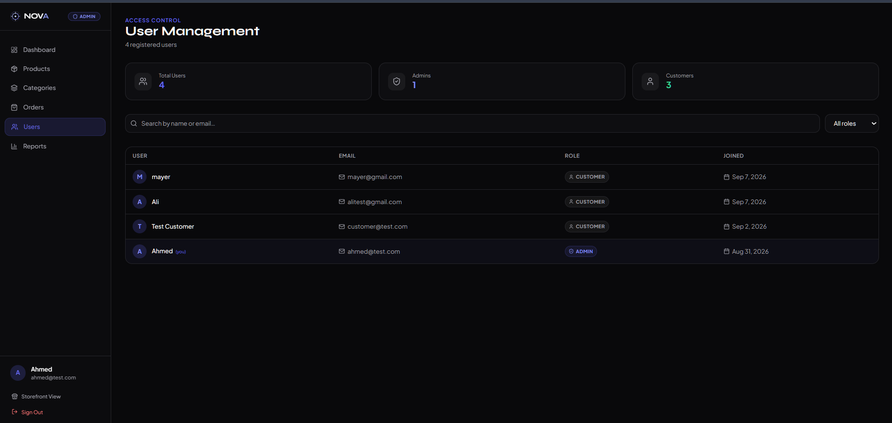

<div align="center">

# ⚡ NOVA Store

**A modern, full-stack e-commerce platform** built with Node.js, Express, MongoDB, and React.

Clean layered architecture · Secure JWT authentication · Real-time inventory · Production-ready admin dashboard

[](#)
[](#)
[](#)
[](#)
[](#)
[](#)

</div>

---

## 📸 Preview

<div align="center">

### Storefront



### Admin Dashboard



</div>

---

## Table of Contents

- [Features](#-features)
- [Tech Stack](#-tech-stack)
- [Architecture](#-architecture)
- [Project Structure](#-project-structure)
- [Authentication](#-authentication)
- [API Reference](#-api-reference)
- [Order Processing](#-order-processing)
- [Environment Variables](#-environment-variables)
- [Installation](#-installation)
- [API Testing](#-api-testing)
- [Security](#-security)
- [Frontend](#-frontend)
- [Admin Dashboard](#-admin-dashboard)
- [Roadmap](#-roadmap)
- [License](#-license)
- [Author](#-author)

---

## ✨ Features

### 🔐 Authentication & Authorization
- User registration and login
- JWT-based authentication
- Protected route middleware
- Role-based authorization (Customer / Admin)

### 📦 Products
- Full CRUD operations (create, read, update, delete)
- Stock management
- Category assignment

### 🗂️ Categories
- Full CRUD operations
- Category-based product organization

### 🛒 Shopping Cart
- Per-user, authenticated cart
- Add, update, and remove items
- Real-time product availability validation

### 📑 Orders
- Order creation from the active cart
- Server-side stock validation before checkout
- Backend-calculated order totals
- Immutable price snapshots at time of purchase
- Automatic stock decrement and cart clearing on success
- Order history and detail retrieval

### 🛠️ Admin
- Admin-only protected endpoints
- Product, category, and order management
- Order status control
- Centralized administrative operations

---

## 🧩 Tech Stack

**Backend**
- Node.js
- Express.js
- MongoDB with Mongoose
- JWT authentication
- ES Modules

**Frontend**
- React with Vite
- TypeScript
- Tailwind CSS
- shadcn/ui
- React Router
- TanStack Query
- Axios
- React Hook Form with Zod validation
- Lucide Icons

---

## 🏗️ Architecture

The backend follows a layered architecture that separates concerns across distinct responsibilities:

```
Request → Routes → Middleware → Controller → Service → Model → MongoDB
```

| Layer | Responsibility |
|---|---|
| **Routes** | Define API endpoints and attach middleware |
| **Middleware** | Handle authentication, authorization, validation, and error processing |
| **Controllers** | Handle incoming HTTP requests and outgoing responses |
| **Services** | Encapsulate core business logic |
| **Models** | Define MongoDB document schemas via Mongoose |

---

## 📁 Project Structure

```
NOVA-Store/
│
├── backend/
│   ├── controllers/
│   ├── middlewares/
│   ├── models/
│   ├── routes/
│   ├── services/
│   ├── config/
│   ├── app.js
│   └── server.js
│
├── frontend/
│   ├── src/
│   │   ├── components/
│   │   ├── pages/
│   │   ├── hooks/
│   │   ├── services/
│   │   ├── types/
│   │   ├── schemas/
│   │   └── routes/
│   └── ...
│
├── Image_README/
│   ├── Dashborad.png
│   ├── Home.png
│   ├── Order.png
│   ├── Report.png
│   └── User.png
│
├── .gitignore
└── README.md
```

---

## 🔑 Authentication

Protected endpoints require a valid JWT access token, sent via the `Authorization` header:

```http
Authorization: Bearer <TOKEN>
```

Two roles are supported:

- `customer`
- `admin`

Admin-only operations require an authenticated user with the `admin` role.

---

## 📡 API Reference

### Authentication

| Method | Endpoint | Description |
|---|---|---|
| POST | `/api/auth/register` | Register a new customer account |
| POST | `/api/auth/login` | Authenticate a user and return an access token |

### Products

| Method | Endpoint | Description |
|---|---|---|
| GET | `/api/products` | Retrieve all products |
| GET | `/api/products/:id` | Retrieve a single product |
| POST | `/api/products` | Create a new product *(admin)* |
| PUT/PATCH | `/api/products/:id` | Update a product *(admin)* |
| DELETE | `/api/products/:id` | Delete a product *(admin)* |

Example product payload:

```json
{
  "name": "Laptop",
  "description": "Modern high-performance laptop",
  "price": 25000,
  "category": "Laptops",
  "stock": 10
}
```

### Categories

| Method | Endpoint | Description |
|---|---|---|
| GET | `/api/categories` | Retrieve all categories |
| GET | `/api/categories/:id` | Retrieve a single category |
| POST | `/api/categories` | Create a new category *(admin)* |
| PUT/PATCH | `/api/categories/:id` | Update a category *(admin)* |
| DELETE | `/api/categories/:id` | Delete a category *(admin)* |

### Cart

| Method | Endpoint | Description |
|---|---|---|
| GET | `/api/cart` | Retrieve the current user's cart |
| POST | `/api/cart/:productId` | Add a product to the cart |
| PATCH | `/api/cart/:productId` | Update item quantity |
| DELETE | `/api/cart/:productId` | Remove an item from the cart |

Example cart item:

```json
{
  "product": "PRODUCT_ID",
  "quantity": 2
}
```

Each cart is scoped to a single authenticated user.

### Orders

| Method | Endpoint | Description |
|---|---|---|
| POST | `/api/orders` | Create an order from the current cart |
| GET | `/api/orders` | Retrieve the authenticated user's orders |
| GET | `/api/orders/:orderId` | Retrieve a specific order |

> Admin order-management endpoints should be documented here once route names are finalized.

**Order lifecycle:**

```
pending → confirmed → processing → shipped → delivered
```

Orders may also be marked as `cancelled` at any applicable stage.

**Order item snapshot:** each order stores the product's name, price, quantity, and product ID at the time of purchase, ensuring historical orders remain unaffected by later price changes.

<div align="center">



</div>

---

## 🧮 Order Processing

**Total calculation** — always computed server-side:

```
item total  = product price × quantity
order total = sum of all item totals
```

Example:

```
Laptop — Price: 25,000 × Quantity: 2 = Total: 50,000
```

**Stock validation** — verified before order creation:

```
Current stock: 5
Requested:     2
Remaining:     3
```

Orders that exceed available stock are automatically rejected.

---

## ⚙️ Environment Variables

Create a `.env` file inside the `backend/` directory:

```env
PORT=5000
MONGODB_URI=your_mongodb_connection_string
JWT_SECRET=your_jwt_secret
```

> **Note:** Never commit real secrets or credentials to version control.

---

## 🚀 Installation

**1. Clone the repository**
```bash
git clone <YOUR_GITHUB_REPOSITORY_URL>
cd NOVA-Store
```

**2. Set up the backend**
```bash
cd backend
npm install
# Configure your .env file (see Environment Variables above)
npm run dev
```

**3. Set up the frontend** (in a separate terminal)
```bash
cd frontend
npm install
npm run dev
```

The frontend will be served via the Vite development server, and the backend will run on the configured `PORT`.

---

## 🧪 API Testing

Recommended end-to-end testing flow:

```
Register → Login → Get Products → Add to Cart →
Update Cart → Create Order → Verify Stock →
Verify Cart Is Empty → Get My Orders
```

Both success and failure paths should be covered, including:

- Valid vs. invalid authentication
- Unauthorized access attempts
- Admin-only authorization checks
- Invalid or missing product IDs
- Empty cart handling
- Insufficient stock scenarios
- Invalid quantity inputs
- Unauthorized order access

---

## 🛡️ Security

NOVA Store applies the following security practices:

- JWT-based authentication
- Protected and role-restricted API routes
- Server-side price and total calculation
- Server-side stock validation
- Secrets managed via environment variables
- User-scoped access to carts and orders

---

## 🖥️ Frontend

The frontend delivers a modern, e-commerce-grade user experience, with attention to:

- Responsive, mobile-first design
- Reusable, accessible components
- Well-defined loading, empty, and error states
- Product search and filtering
- Smooth navigation and transitions
- A dedicated admin dashboard with order management and reporting

---

## 🎛️ Admin Dashboard

The Admin Dashboard centralizes store operations across the following areas:

```
Dashboard · Products · Categories · Orders · Users · Reports · Settings
```

All analytics and reports are driven by real backend data — no fabricated or placeholder statistics.

<div align="center">

### Inventory & Sales Reports



### User Management



</div>

---

## 🗺️ Roadmap

Planned improvements include:

- MongoDB transactions for atomic order creation
- Redis caching
- Background job processing with BullMQ
- Email notifications
- Payment gateway integration
- Product image uploads via Cloudinary
- Advanced analytics
- Wishlist and reviews/ratings
- Docker-based deployment
- CI/CD pipeline
- Automated test coverage

---

## 📄 License

This project is developed for learning and portfolio purposes.

---

## 👤 Author

**Ahmed Adel**
Full-Stack Developer

---

<div align="center">

*Build. Learn. Improve. Ship.*

</div>
